<!-- APP DOWNLOAD LINKS -->
<p align="center">
  <h2 align="center">🚀 Download & Explore <b>مسوقجي</b></h2>
  <a href="https://play.google.com/store/apps/details?id=com.shopper.ssgit" target="_blank">
    
  </a>
  <a href="https://apps.apple.com/gb/app/%D9%85%D8%B3%D9%88%D9%82%D8%AC%D9%8A/id6504242156" target="_blank">
    
  </a>
  <a href="https://www.miswagchi.com/en" target="_blank">
    
  </a>
</p>

# مسوقجي (Masoukji)

A robust, production-ready recipe marketplace and delivery platform, connecting users with expert-crafted recipes, health solutions, and seamless ingredient delivery. Built with Flutter for cross-platform excellence.

---

## 📖 Table of Contents

1. [Introduction](#introduction)
2. [Features](#features)
3. [System Architecture](#system-architecture)
4. [Project Structure](#project-structure)
5. [Installation](#installation)
6. [Usage](#usage)
7. [Configuration](#configuration)
8. [Technologies Used](#technologies-used)
9. [Screenshots](#screenshots)
10. [Contribution Guide](#contribution-guide)
11. [FAQ](#faq)
12. [Support](#support)
13. [License](#license)
14. [Credits](#credits)

---

## 🏁 Introduction

مسوقجي (Masoukji) is a comprehensive platform for discovering, buying, and selling recipes across food, health, and wellness categories. The app connects users with experts and enthusiasts, offering a seamless experience from recipe discovery to ingredient delivery. Designed for scalability, security, and user-friendliness, مسوقجي is available on Android, iOS, and web platforms.

---

## 🌟 Features

- **Recipe Marketplace:** Buy and sell recipes in various categories (food, health, beauty, home, etc.).
- **Expert-Crafted Content:** Recipes from nutritionists, chefs, and health professionals.
- **Seamless Delivery:** Order ingredients or ready-made solutions delivered to your door.
- **AI-Powered Recommendations:** Personalized suggestions based on user preferences.
- **Secure Payments:** Integrated with KiCard and other gateways.
- **Multi-Language Support:** English, Arabic, and more.
- **User Profiles & Social Features:** Save favorites, track purchases, and interact with the community.
- **Modern UI/UX:** Intuitive navigation and visually appealing design.

---

## 🏗️ System Architecture

The system is built using a modular, layered architecture for maintainability and scalability:

- **Presentation Layer:** Flutter-based UI for Android, iOS, and web. Organized into screens, widgets, and themes.
- **Business Logic Layer:** Controllers and providers manage state, user actions, and business rules.
- **Data Layer:** Repositories and data sources handle API communication, local storage, and caching.
- **Backend (not included):** The app communicates with a RESTful API for authentication, recipes, orders, and payments.
- **Assets:** Centralized management of images, videos, and language files for localization.

**Typical Flow:**
1. User interacts with the UI (e.g., searches for a recipe).
2. Controller processes the action, fetches data from the repository.
3. Repository communicates with remote API or local cache.
4. Data is returned, processed, and displayed in the UI.

---

## 📂 Project Structure

```
masoukji-develop/
│
├── lib/                # Main application code
│   ├── config/         # App configuration (colors, shared preferences)
│   ├── controller/     # State management and business logic
│   ├── data/           # Models, repositories, API clients, data sources
│   ├── helper/         # Utility helpers (database, date, notifications)
│   ├── theme/          # Light and dark themes
│   ├── util/           # Utilities (constants, enums, extensions)
│   ├── view/           # UI screens and widgets
│   ├── widget/         # Reusable UI components
│   └── main.dart       # App entry point
│
├── assets/             # Static assets
│   ├── image/          # App images and icons
│   ├── json/           # Animation and data files
│   ├── language/       # Localization files
│   ├── screenshots/    # App screenshots for documentation
│   └── videos/         # Video assets
│
├── android/            # Android-specific code
├── ios/                # iOS-specific code
├── web/                # Web-specific code
├── macos/              # macOS-specific code
├── windows/            # Windows-specific code
├── linux/              # Linux-specific code
├── test/               # Unit and widget tests
└── README.md           # Project documentation
```

**Key Directories Explained:**
- `lib/`: All Dart source code, organized by feature and responsibility.
- `assets/`: Images, language files, and other static resources.
- `android/`, `ios/`, etc.: Platform-specific configuration and native code.
- `test/`: Automated tests to ensure code quality.

---

## 🛠️ Installation

### Prerequisites
- [Flutter SDK](https://flutter.dev/docs/get-started/install)
- Dart >= 2.17.0
- Android Studio / Xcode / VS Code

### Steps
```bash
# Clone the repository
git clone <your-repo-url>
cd masoukji-develop

# Get dependencies
flutter pub get

# Run the app
flutter run
```

---

## 🚦 Usage

- Launch the app on your device or emulator.
- Sign up or log in to your account.
- Browse, search, and filter recipes.
- Purchase recipes or order ingredients for delivery.
- Sell your own recipes and manage your profile.
- Use AI-powered recommendations for personalized suggestions.

---

## ⚙️ Configuration

- **Localization:** Add or edit language files in `assets/language/`.
- **API Endpoints:** Configure API URLs and keys in the appropriate config files under `lib/config/`.
- **Themes:** Customize app appearance in `lib/theme/`.
- **Assets:** Add new images or videos to the relevant `assets/` subfolders.

---

## 🧰 Technologies Used

- **Flutter** (Dart) for cross-platform development
- **RESTful APIs** for backend communication
- **Provider / GetX / Bloc** (as per implementation) for state management
- **Firebase** (optional, for notifications, analytics, etc.)
- **KiCard** and other payment gateways
- **Localization** for multi-language support

---

## 🖼️ Screenshots

### Onboarding & Authentication
| Onboarding 1 | Onboarding 2 | Onboarding 3 | Language Selection | Login |
|:---:|:---:|:---:|:---:|:---:|
| 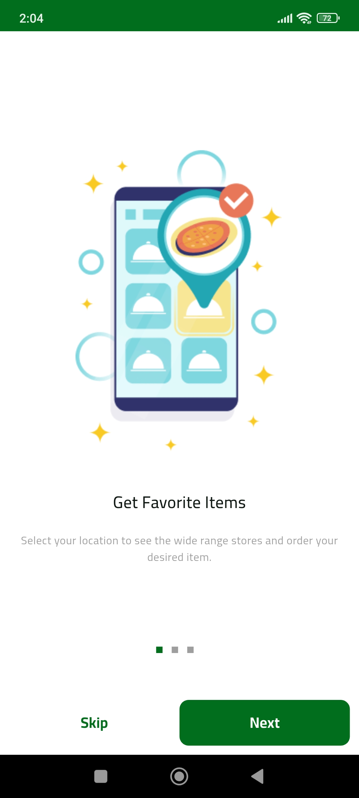 |  | 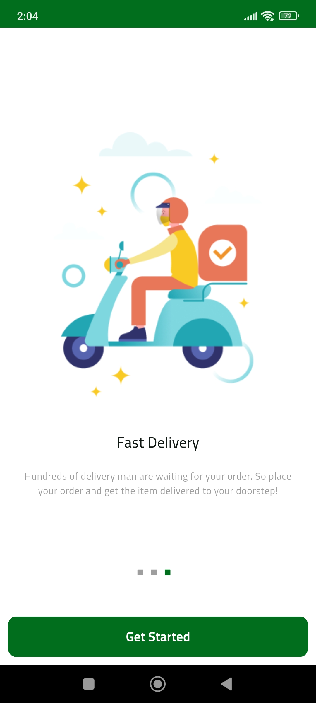 | 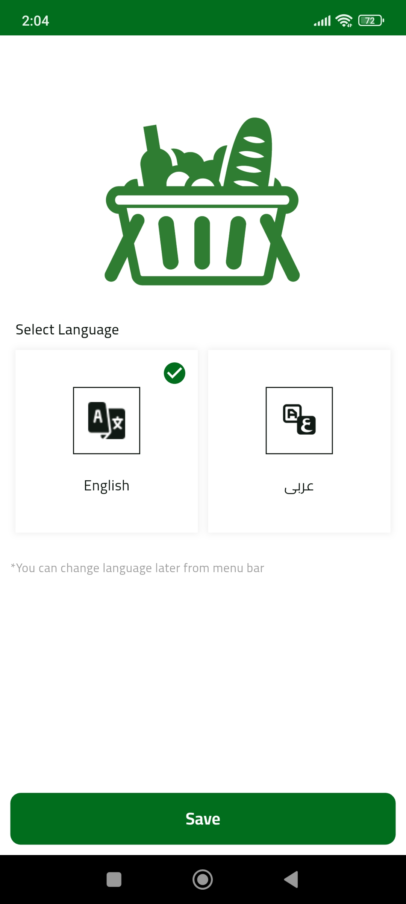 | 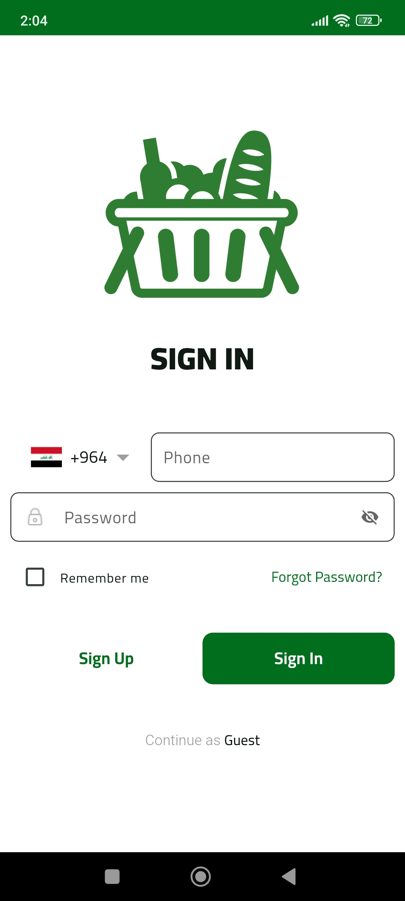 |

### Home & Showcase
| Home 1 | Home 2 | Showcase 1 | Showcase 2 | Showcase 3 |
|:---:|:---:|:---:|:---:|:---:|
| 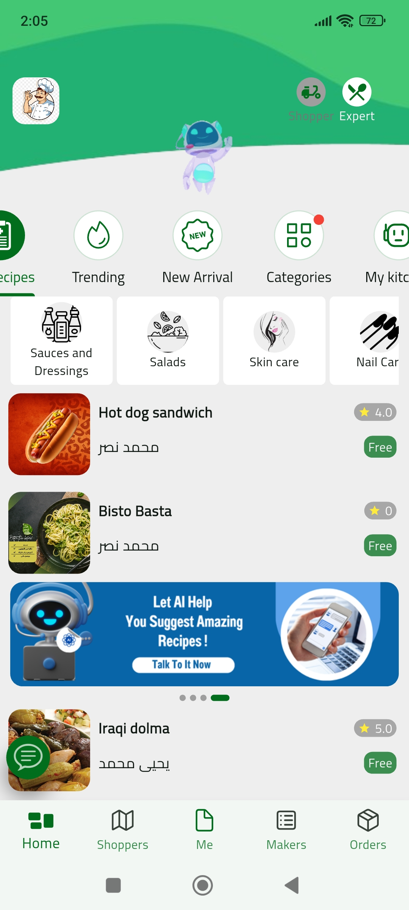 | 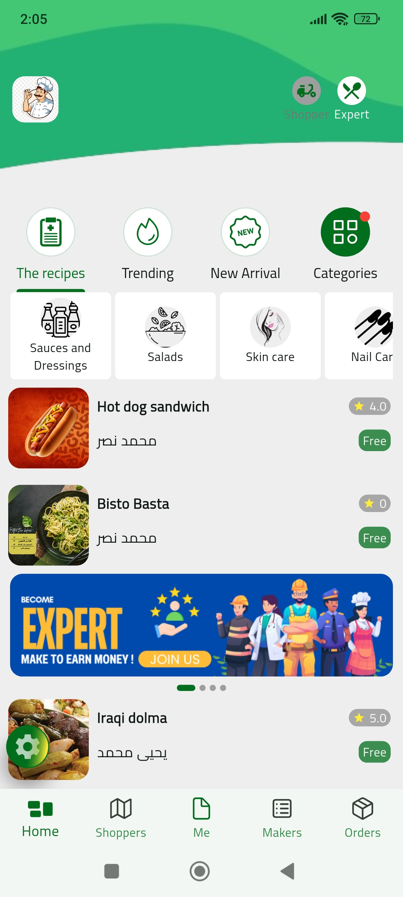 |  | 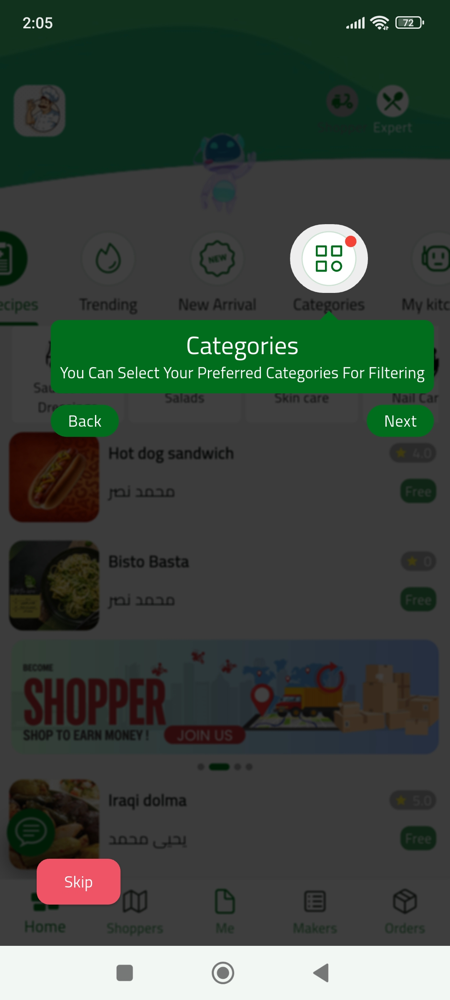 | 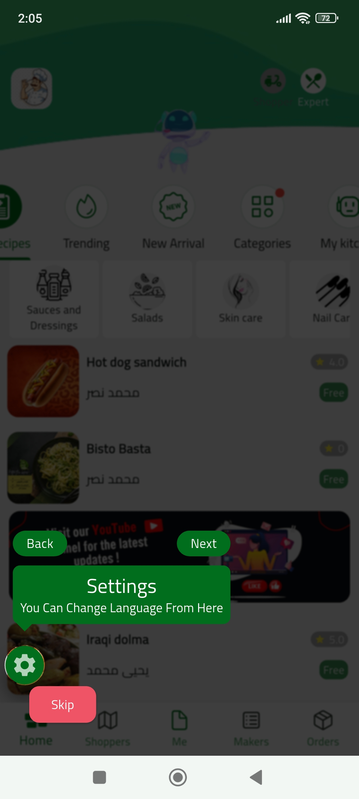 |

### User & Profile
| Profile | User Profile | User Profile 2 | Me Overview |
|:---:|:---:|:---:|:---:|
|  | 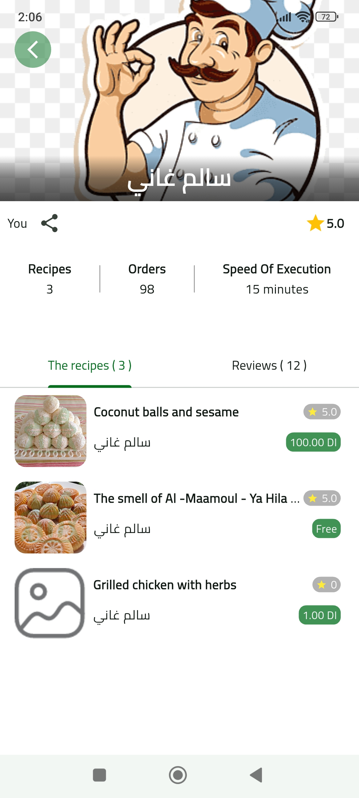 | 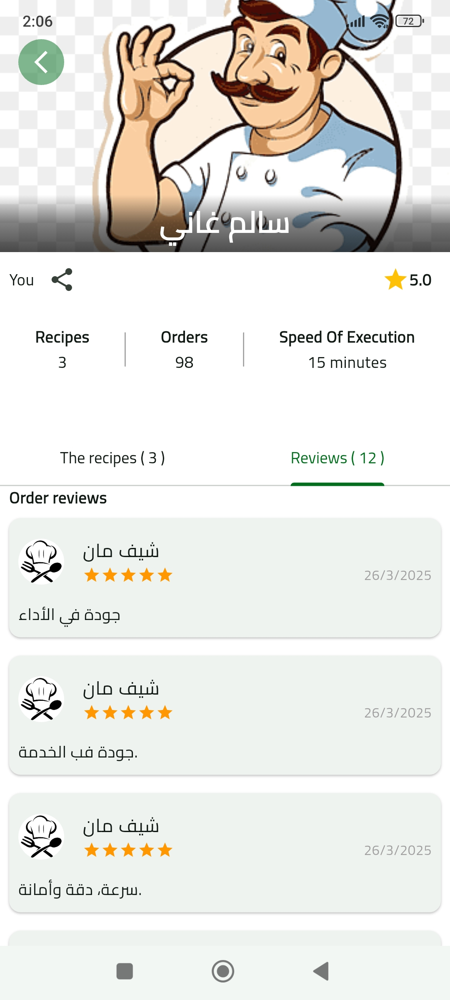 | 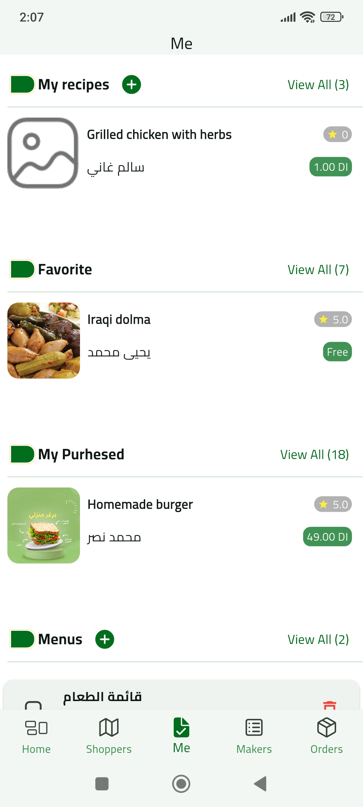 |

### Orders & Details
| Orders | Order Details 1 | Order Details 2 |
|:---:|:---:|:---:|
| 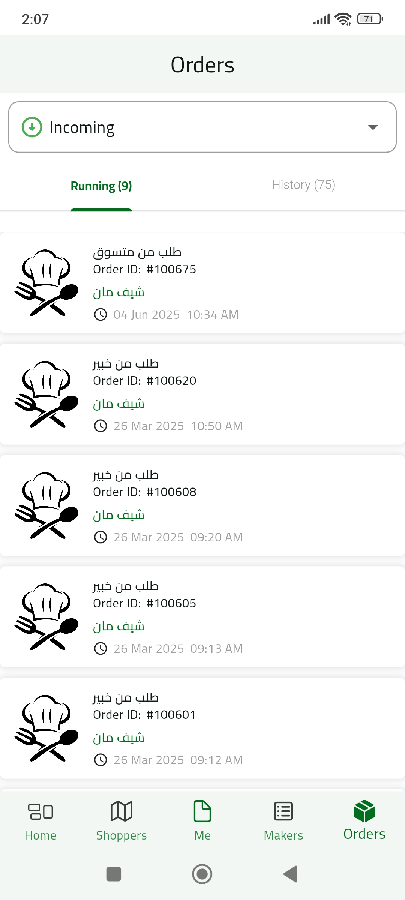 | 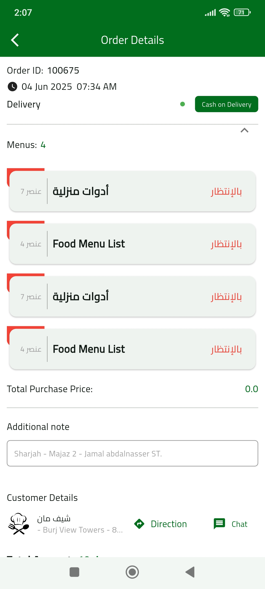 | 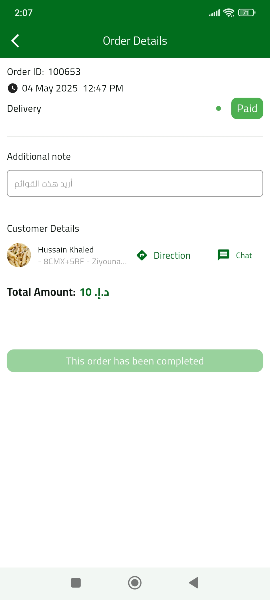 |

### Recipes
| Recipe Details 1 | Recipe Details 2 | Recipe Details 3 | Recipe Details 4 |
|:---:|:---:|:---:|:---:|
|  | 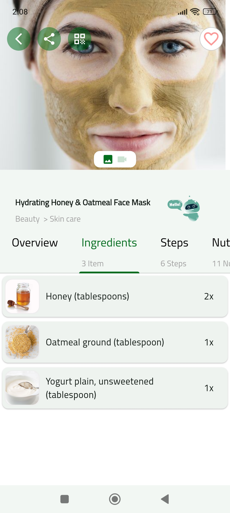 |  |  |

### AI & Chat
| AI Agent | Chat |
|:---:|:---:|
|  | 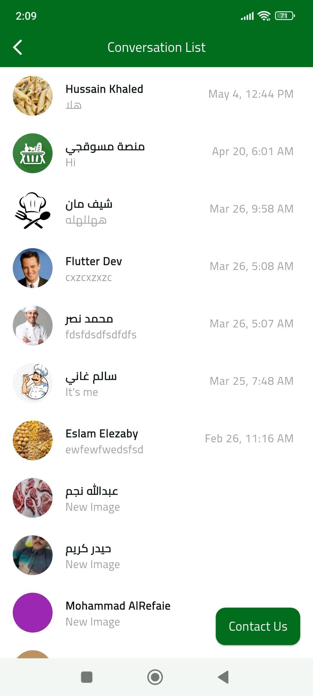 |

### Location & Search
| Location | Search |
|:---:|:---:|
| 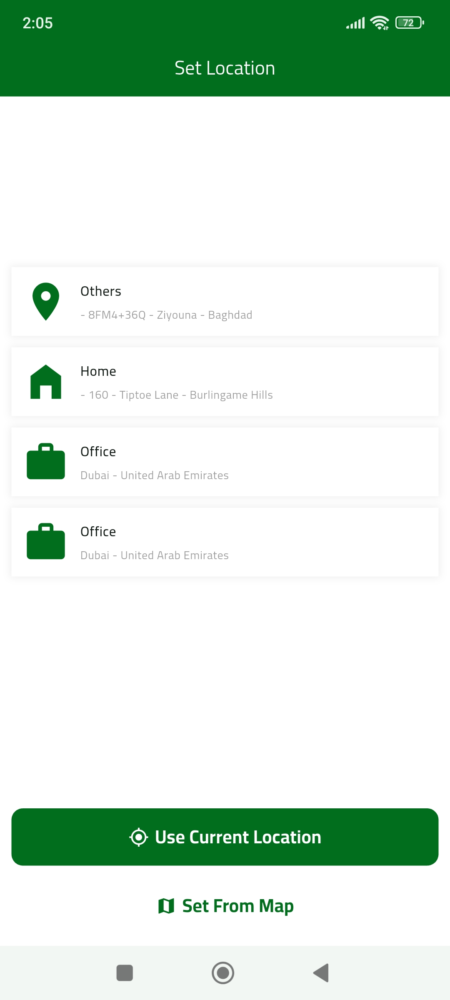 | 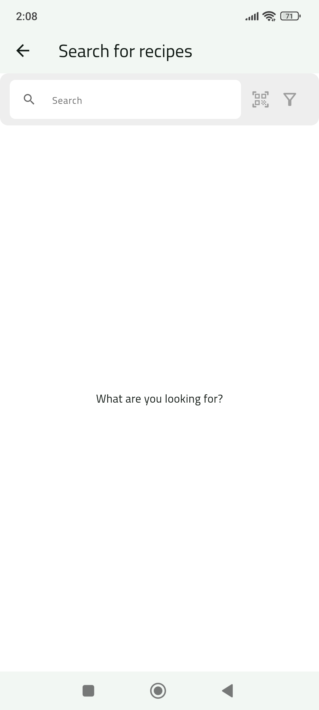 |

### Makers & Live Shoppers
| Makers | Live Shoppers |
|:---:|:---:|
|  | 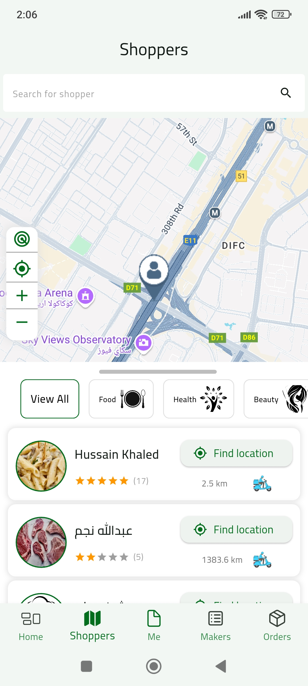 |

### Support & Settings
| Support | Settings |
|:---:|:---:|
|  | 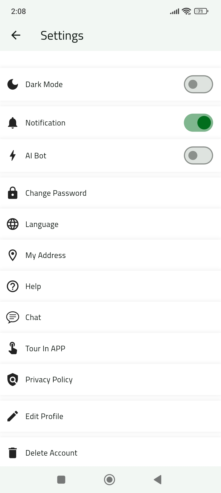 |

---

## 🤝 Contribution Guide

We welcome contributions from the community! To contribute:
1. Fork the repository.
2. Create a new branch for your feature or bugfix.
3. Commit your changes with clear messages.
4. Submit a pull request describing your changes.
5. Ensure your code passes all tests and follows the project's style guidelines.

---

## ❓ FAQ

**Q: What platforms are supported?**  
A: Android, iOS, and web (with desktop support in progress).

**Q: How do I add a new language?**  
A: Add a new JSON file in `assets/language/` and update the localization config.

**Q: How do I report a bug or request a feature?**  
A: Please open an issue on the [GitHub Issues page](https://github.com/your-repo/issues).

---

## 🆘 Support

For support, contact the developer:
- **ENG. Mohammad AlRefaie**
- 📞 +971 56 756 1512
- ✉️ eng.mohammad.uae@gmail.com

Or visit our [website](https://www.miswagchi.com/en).

---

## 📄 License

This project is licensed under the MIT License - see the [LICENSE](LICENSE) file for details.

---

## 🙏 Credits

- Developed by **ENG. Mohammad AlRefaie**
- Powered by [Smart Science Gate Information Technology](https://www.miswagchi.com/en)
- Built with [Flutter](https://flutter.dev/)
- Special thanks to all contributors and users

---

## 📲 Download

- **Google Play:** [مسوقجي on Google Play](https://play.google.com/store/apps/details?id=com.shopper.ssgit)
- **App Store:** [مسوقجي on App Store](https://apps.apple.com/gb/app/%D9%85%D8%B3%D9%88%D9%82%D8%AC%D9%8A/id6504242156)
- **Website:** [www.miswagchi.com/en](https://www.miswagchi.com/en)
